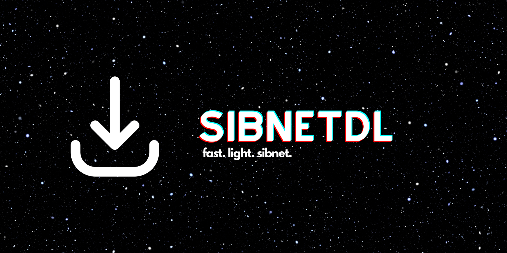

# SibnetDL

## Genel Bakış

SibnetDL, PyQt5 ve pySmartDL kullanılarak geliştirilmiş, video indirme işlemleri için kullanıcı dostu bir arayüz sunan Python tabanlı bir uygulamadır. Bu araç, metin dosyasında bulunan çeşitli kaynaklardan video indirme görevlerini yönetmenizi sağlar.

### Özellikler

- **URL Listesi Oluşturma**: Video indirmek için URL listesi oluşturun.
- **İndirme Linklerini Alma**: Video indirme için linkleri edinin.
- **Video İndirme**: Sağlanan linklerden videoları indirin.
- **Kullanıcı Dostu Arayüz**: Sorunsuz bir kullanıcı deneyimi için temiz ve basit bir arayüz.

## Kurulum

1. Python'un yüklü olduğundan emin olun.
2. Depoyu yerel makinenize klonlayın.
3. Gerekli paketleri yükleyin: `pip install -r requirements.txt`.
4. Uygulamayı çalıştırın: `python sibnetDL.py`.

## Kullanım

1. **URL Listesi Oluşturma**
    - "Oluştur" sekmesine tıklayın ve URL ile video bölümlerinin toplam sayısını girin.
    - "Bölüm Linklerini Oluştur" seçeneğine tıklayarak URL içeren bir dosya oluşturun.

2. **İndirme Linklerini Alma**
    - "Çek" sekmesine tıklayarak oluşturulan URL listesinden indirme linklerini alın.
    - İstenen dosyayı ve hedef klasörü seçin.

3. **Videoları İndirme**
    - URL'leri içeren metin dosyasını ve hedef klasörü seçin.
    - İndirme işlemini başlatmak için "Başlat" seçeneğine tıklayın.

## Katkılar

Katkılarınızı bekliyoruz! Önemli değişiklikler için önce bir konu açarak tartışabilirsiniz.

1. Depoyu çatallayın (fork).
2. Özellik dalı oluşturun: `git checkout -b özellik/HarikaÖzellik`.
3. Değişikliklerinizi kaydedin: `git commit -m 'HarikaÖzellik ekle'`.
4. Dalı ana depoya gönderin: `git push origin özellik/HarikaÖzellik`.
5. Bir birleştirme isteği (pull request) açın.

## Lisans

GLPv3 Lisansı altında dağıtılır. Daha fazla bilgi için `LICENSE` dosyasına bakabilirsiniz.
